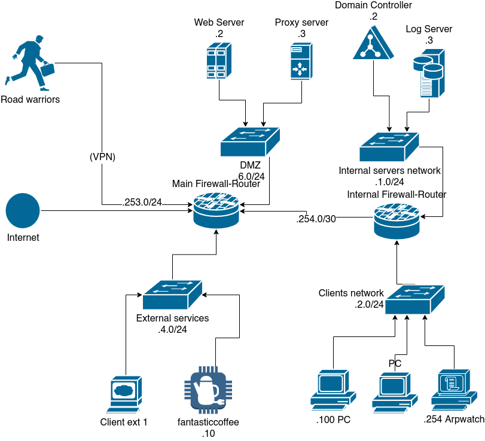

# Assignment 1

## Main Objectives

- Manage and harden the new network infrastructure.
- Introduce IPv6.
- Enforce a new security policy.

## IPv6 requirements

- You can assume to always have the **same prefix**.
- Enable **IPv6** on the ***Main Firewall***:
  - Ask the ISP for a /56 prefix.
  - It is possible to use the `SOLICIT` option.
- **Redistribute prefix** to the *DMZ* network.
- Configure the other networks according to your design.
- ***DMZ*** network:
  - Statically assign IP addresses.
  - Should be accessible from outside.
- ***Server*** network:
  - Statically assign IP addresses.
  - Should be accessible from the *DMZ*.

## DNS requirements

- The *Domain Controller* machine handles DNS.
- Every host should use the internal DNS.
- You can use Zentyal.
- If you want to support IPv6, you can user other DNS servers.

## Security policy

- Only allow the internal DNS as resolver.
- Only the webserver in the *DMZ* should be accessible from outside.
- The proxy is accessible only from the ACME network.
- The proxy can initiate connections to outside.
- The *Internal servers* network should be accessible only from the *Client* and *DMZ* networks.
- All the hosts (except the *Client* network) have to use the `syslog` service on the Log server.
- SSH can be only used from the *Client* network hosts.
- The *Client* network can only access external web services.
- `deny` as default policy.

## ACME services

| Service   | Host              | Network          |
| --------- | ----------------- | ---------------- |
| Webserver | Web Server        | DMZ              |
| Proxy      | Proxy Server      | DMZ              |
| DNS       | Domain Controller | Internal servers |
| Syslog    | Log Server        | Internal servers |

